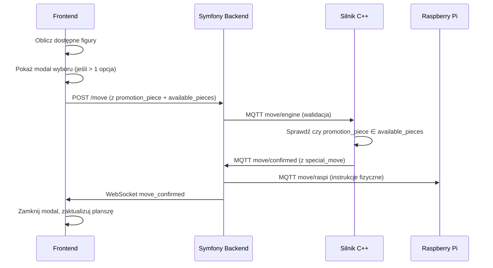

# Promocja Pionka - Implementacja i Testowanie

## Przegląd funkcjonalności

System promocji pionka został w pełni zaimplementowany z uwzględnieniem fizycznych ograniczeń planszy:

### ✅ Zaimplementowane funkcje:

1. **Frontend (JavaScript)**:

   - Modal wyboru figury do promocji (Q, R, B, N)
   - Obsługa klawiatury (klawisze Q, R, B, N)
   - Automatyczny wybór gdy tylko jedna figura dostępna
   - Fallback do damy gdy brak dostępnych figur
   - Obliczanie dostępnych figur na podstawie zbitych

2. **Backend (Symfony)**:

   - Walidacja promocji w `MoveController`
   - Obsługa `available_pieces` i `captured_piece`
   - Przekazywanie danych przez MQTT

3. **Silnik C++**:
   - Walidacja dostępnych figur do promocji
   - Obsługa promocji z biciem (`promotion_capture`)
   - Rozróżnianie między zwykłą promocją a promocją z biciem

## Fizyczne ograniczenia planszy

System respektuje fizyczne ograniczenia planszy:

- **Nie można mieć więcej figur niż na początku gry**
- **Promocja możliwa tylko do figur zbitych lub pierwotnie dostępnych**
- **Automatyczny fallback do damy gdy brak opcji**

### Liczba figur na początku gry:

- **1 dama** na kolor
- **2 wieże** na kolor
- **2 gońce** na kolor
- **2 skoczki** na kolor

## Edge cases i obsługa:

### 1. **Brak dostępnych figur**

```
Sytuacja: Wszystkie figury (q,r,b,n) są już na planszy, żadne nie zostały zbite
Obsługa: Automatyczny wybór damy (zawsze możliwy)
```

### 2. **Jedna dostępna figura**

```
Sytuacja: Tylko jedna figura jest dostępna (np. tylko skoczek został zbity)
Obsługa: Automatyczne promowanie bez pokazywania modala
```

### 3. **Standardowa promocja**

```
Sytuacja: Wiele figur dostępnych
Obsługa: Modal z wyborem dostępnych figur
```

### 4. **Promocja z biciem**

```
Sytuacja: Pion bije podczas promocji
Obsługa: Dodatkowe info o zbitej figurze + modal wyboru
```

## Testowanie

### Test 1: Standardowa promocja

1. Przesuń białego pionka na e7
2. Przesuń na e8 (promocja)
3. Sprawdź czy pojawia się modal z 4 opcjami
4. Wybierz figurę (Q/R/B/N lub klik)

### Test 2: Promocja z biciem

1. Ustaw czarną figurę na f8
2. Przesuń białego pionka z e7 na f8 (bicie + promocja)
3. Sprawdź czy pojawia się modal
4. Wybierz figurę

### Test 3: Edge case - brak figur

```javascript
// Symulacja w konsoli przeglądarki:
window.boardState = {
  // Ustaw wszystkie figury na planszy (bez zbitych)
  a1: "wr",
  b1: "wn",
  c1: "wb",
  d1: "wq",
  e1: "wk",
  f1: "wb",
  g1: "wn",
  h1: "wr",
  // ... dodaj wszystkie figury
};
// Wyczyść zbite figury
window.resetCaptures();
// Spróbuj promocji - powinna automatycznie wybrać damę
```

### Test 4: Edge case - jedna figura

```javascript
// Dodaj tylko jedną zbitą figurę
window.capturePiece("wn"); // tylko skoczek dostępny
// Spróbuj promocji - powinna automatycznie wybrać skoczka
```

## API i komunikacja

### Format żądania promocji:

```json
{
  "from": "e7",
  "to": "e8",
  "special_move": "promotion",
  "promotion_piece": "queen",
  "available_pieces": ["queen", "rook", "bishop", "knight"]
}
```

### Format promocji z biciem:

```json
{
  "from": "e7",
  "to": "f8",
  "special_move": "promotion_capture",
  "promotion_piece": "queen",
  "captured_piece": "rook",
  "available_pieces": ["queen", "rook", "bishop", "knight"]
}
```

## Pliki zmodyfikowane:

1. **Frontend**:

   - `index.php` - dodano `promotion.js`
   - `promotion.js` - zaktualizowano logikę dostępnych figur
   - `chessboard.js` - dodano funkcje obliczania dostępnych figur
   - `backend-integration.js` - integracja z modułem promocji

2. **Silnik C++**:

   - `payloads.h` - dodano `available_pieces` i `captured_piece`
   - `main_mqtt.cpp` - walidacja i obsługa promocji z biciem

3. **Backend**:
   - Już było zaimplementowane (bez zmian)

## Debugging

### Logi w konsoli:

```
[PROMO] - działania modułu promocji
[Engine] - działania silnika C++
[Mercure] - komunikacja WebSocket
```

### Ważne funkcje do debugowania:

```javascript
// sprawdź dostępne figury dla koloru
window.getAvailablePromotionPieces("w");

// sprawdź stan planszy
console.log(window.boardState);

// sprawdź zbite figury
document.querySelectorAll("[data-piece-type]");
```


